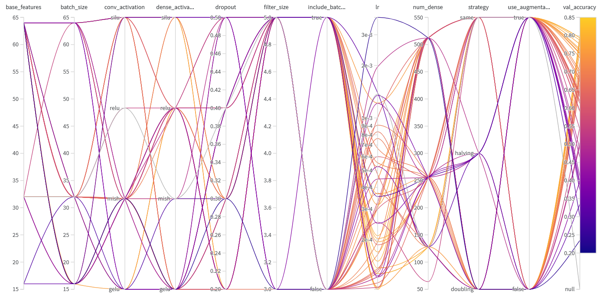
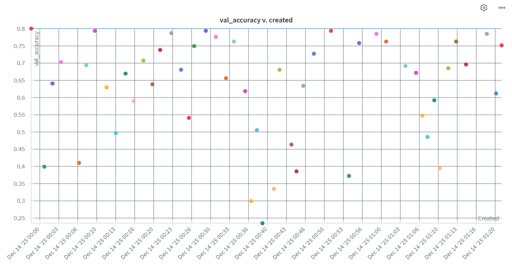
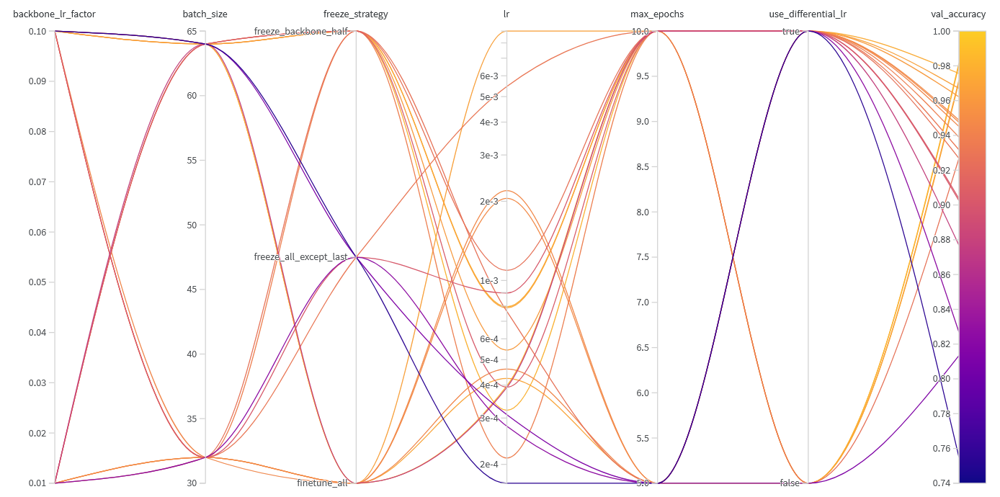
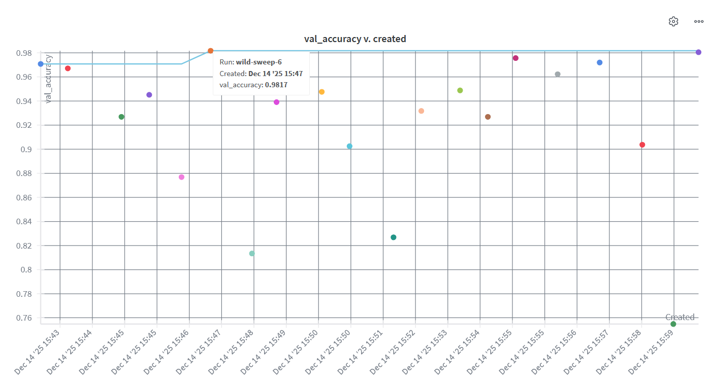

# Scientific Report and Model Explainability

This report details the scientific findings and explainability analysis of our Garbage Classification models. It includes visualizations of feature maps, guided backpropagation results, and hyperparameter optimization studies.

## 1. Feature Map Analysis

In Convolutional Neural Networks (CNNs), the initial layers typically function as low-level feature extractors. Visualizing these layers helps confirm that the model is learning meaningful patterns from the data.

**Findings:**
*   **Edge and Boundary Detection:** The feature maps from the first convolutional layer demonstrate a strong focus on detecting edges, curves, and boundaries.
*   **Structural Foundations:** This observation confirms that the early layers are successfully establishing the structural basis required for more complex feature extraction in subsequent layers.

## 2. Model Explainability: Guided Backpropagation

To interpret the internal representations of the network, we employed Guided Backpropagation. This method visualizes which parts of the input image activate specific neurons in deeper layers.

.png)

**Findings:**
*   **Neuron Specialization:** The visualizations for the fifth convolutional layer (CONV5) show that different neurons focus on distinct parts of the image.
*   **Semantic Separation:** The model effectively distinguishes valid object features from background noise, indicating a robust hierarchical representation of the garbage classes.

## 3. Hyperparameter Analysis and Performance

We utilized Weights & Biases to track and visualize the impact of various hyperparameters on model performance. The following plots illustrate the results for both the model trained from scratch and the fine-tuned model.

### 3.1. Model Trained from Scratch

**Observations:**
The parallel coordinates plot reveals the correlation between specific hyperparameter configurations (such as learning rate and batch size) and the resulting validation accuracy. The distribution plot highlights the variance in performance across different initialization and training runs.

### 3.2. Fine-Tuned Model

**Observations:**
The fine-tuning experiments demonstrate a more consistent performance profile. The plots indicate that leveraging pre-trained weights significantly stabilizes the training process, leading to higher average validation accuracy compared to the scratch model.
